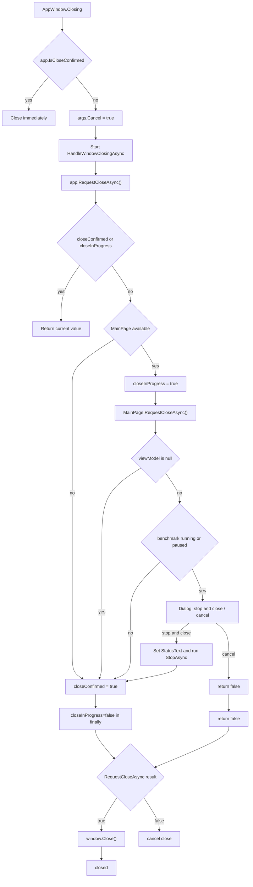

# Close Dialog Flow

```mermaid
flowchart TD
  A["AppWindow.Closing"] --> B{app.IsCloseConfirmed}
  B -- yes --> C["Close immediately"]
  B -- no --> D["args.Cancel = true"]
  D --> E["Start HandleWindowClosingAsync"]
  E --> F["app.RequestCloseAsync()"]

  F --> G{closeConfirmed or closeInProgress}
  G -- yes --> H["Return current value"]
  G -- no --> I{MainPage available}
  I -- no --> J["closeConfirmed = true"]
  I -- yes --> K["closeInProgress = true"]
  K --> L["MainPage.RequestCloseAsync()"]

  L --> M{viewModel is null}
  M -- yes --> J
  M -- no --> N{benchmark running or paused}
  N -- yes --> O["Dialog: stop and close / cancel"]
  N -- no --> J
  O -- stop and close --> Q["Set StatusText and run StopAsync"]
  O -- cancel --> R["return false"]
  Q --> J

  J --> W["closeInProgress=false in finally"]
  W --> Y{RequestCloseAsync result}
  R --> X["return false"]
  X --> Y
  Y -- true --> Z["window.Close()"]
  Y -- false --> AA["cancel close"]
  Z --> AB["closed"]
```

## References
- `Benchmark/MauiProgram.cs`
- `Benchmark/App.xaml.cs`
- `Benchmark/Shared/UI/MainPage.cs`
